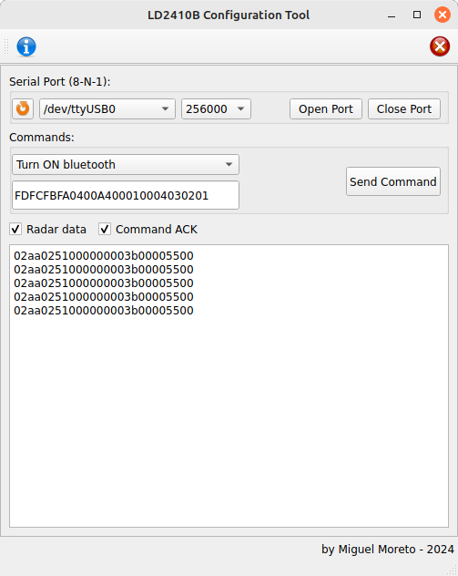

# LD2410B configuration tool
A simple pyQt application to configure the [LD2410B](https://www.hlktech.net/index.php?id=1183) microwave presence sensor using the serial port.

The original configuration program supplied by HiLink does not allow some settings, such as disabling the bluetooth function. In my application I don't need this functionality, which is why I ended up developing this program.

The program receives and sends data frames via the serial interface, according to the protocol defined by HiLink, where two types of frames are defined:

* Data frames: are sent periodically by the device. This is the information used by the HiLink program to display the graphics.
* Command frames: these are sent to the device to change its settings, such as baudrate, bluetooth interface status, detection parameters, etc.
* Acknolegment frames: are sent by the device in response to command frames.

Some commands are already pre-registered in the program's user interface. The responses to the commands (ack) and the data frames are shown on the interface but are not interpreted by the program. Perhaps in a future version. For now, the program already meets my needs, as the HiLink application can be used to monitor the presence sensor in more detail.

More information can be found in the HiLink documentation about the LD2410B module in https://drive.google.com/drive/folders/16zI-fium_BZeP08EyQke0rWp0BJTMvw3 where you will find a PDF file with the description of the serial protocol.

## Dependencies

This program was written in python 3 and depends on the following modules:

* pySerial (https://pypi.org/project/pyserial/)
* pyQt5 (https://pypi.org/project/PyQt5/)

## Screenshots

## About

Developed by Miguel Moreto. Florianopolis, SC, Brazil.